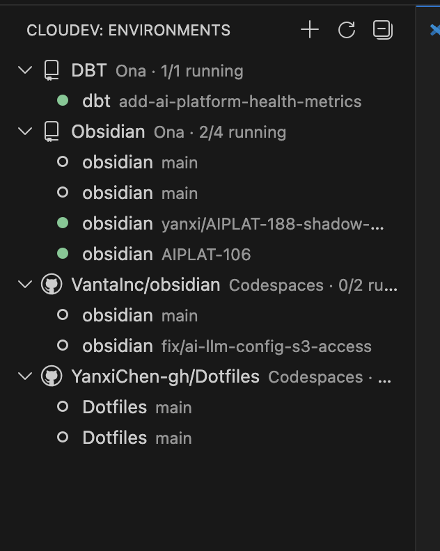

# Cloudev

[](https://github.com/YanxiChen-gh/Cloudev/actions/workflows/ci.yml)
[](https://marketplace.visualstudio.com/items?itemName=Yanix.cloudev)
[](LICENSE)

Manage cloud development environments from VS Code. Start, stop, forward ports, and connect to environments across **Gitpod (Ona)** and **GitHub Codespaces** from a single sidebar.

<!-- TODO: Add screenshot once available

-->

## Features

- **Unified sidebar** -- environments from all providers, grouped by project
- **Port forwarding** -- auto-discovers remote ports, tunnels to localhost, detects conflicts
- **Port conflict detection** -- warns when another process (VS Code Remote, docker, etc.) holds a port
- **Favorites** -- star frequently-used environments and ports for quick access
- **One-click connect** -- open environments in a new VS Code Remote SSH window
- **Create/delete** -- provision new environments with project and machine class pickers
- **Persistent daemon** -- port forwarding survives VS Code reloads; auto-resumes on restart
- **Status bar** -- daemon health, forwarded port count, running environment count
- **Multi-window** -- all VS Code windows share state via a background daemon

## Quick Start

### Install

Search "Cloudev" in the VS Code Extensions panel, or:

```
ext install Yanix.cloudev
```

### Setup

**Gitpod (Ona):**
1. Install the [Gitpod CLI](https://www.gitpod.io/docs/references/gitpod-cli) at `/usr/local/bin/gitpod`
2. Log in: `gitpod login`
3. Your environments will appear in the Cloudev sidebar

**GitHub Codespaces:**
1. Install the [GitHub CLI](https://cli.github.com/)
2. Log in: `gh auth login`
3. Grant the codespace OAuth scope:
   ```
   gh auth refresh -h github.com -s codespace
   ```
4. Codespaces will appear alongside Gitpod environments

## Commands

| Command | Description |
|---------|-------------|
| `Cloudev: Create Environment` | Create a new environment |
| `Cloudev: Start / Stop / Restart` | Environment lifecycle |
| `Cloudev: Delete Environment` | Delete a stopped environment |
| `Cloudev: Forward Ports` | Start port forwarding |
| `Cloudev: Stop Port Forwarding` | Stop forwarding |
| `Cloudev: Switch Port Forwarding Target` | Quick-switch which env is forwarded |
| `Cloudev: Open in New Window` | Open Remote SSH to the environment |
| `Cloudev: Open in Dashboard` | Open the provider's web UI |
| `Cloudev: Copy SSH Command` | Copy the SSH command to clipboard |
| `Cloudev: View Daemon Log` | Open the daemon log file for debugging |
| `Cloudev: Start Daemon` | Manually start or reconnect to the daemon |

## How It Works

A background daemon process manages all state, SSH tunnels, and CLI interactions. Each VS Code window connects to the daemon over a Unix socket (`~/.cloudev/daemon.sock`). Port forwarding survives window reloads, and all windows see the same state instantly.

```
VS Code Window 1 --+
                    +-- IPC (Unix socket) --> Background Daemon
VS Code Window 2 --+                         +-- SSH tunnels
                                              +-- Port discovery
                                              +-- CLI calls (gitpod, gh)
                                              +-- State broadcasts
```

The daemon auto-starts when the extension activates and stays alive while ports are being forwarded. On extension update, the daemon is gracefully restarted to pick up new code.

## Troubleshooting

**Daemon won't start**
- Check the log: `Cloudev: View Daemon Log` command, or open `~/.cloudev/daemon.log`
- Kill stale daemon: `kill $(cat ~/.cloudev/daemon.pid)` then reload VS Code

**SSH config errors (Bad configuration option)**
- The Gitpod CLI sometimes writes corrupted SSH configs. Cloudev auto-fixes this after each sync, but if you see it: `sed -i '' 's/^Only yes$/IdentitiesOnly yes/' ~/.ssh/gitpod/*/config`

**Port conflict warnings**
- Another process holds the port on localhost. The warning shows which process (e.g., "VS Code Remote SSH")
- If VS Code Remote is forwarding ports for the same env, you can disable it: set `remote.autoForwardPorts: false`

**Codespaces 403 error**
- The `gh` CLI needs the `codespace` OAuth scope: `gh auth refresh -h github.com -s codespace`

## Contributing

See [CONTRIBUTING.md](CONTRIBUTING.md) for development setup, architecture overview, and how to add a new provider.

## License

[MIT](LICENSE)
